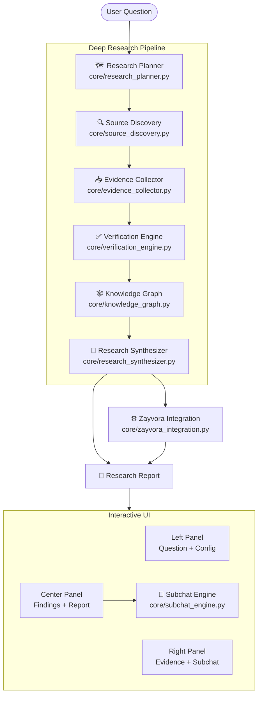
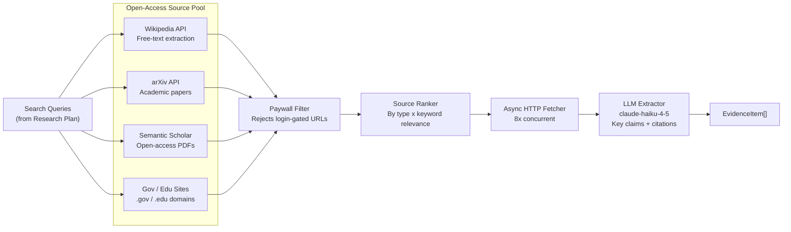
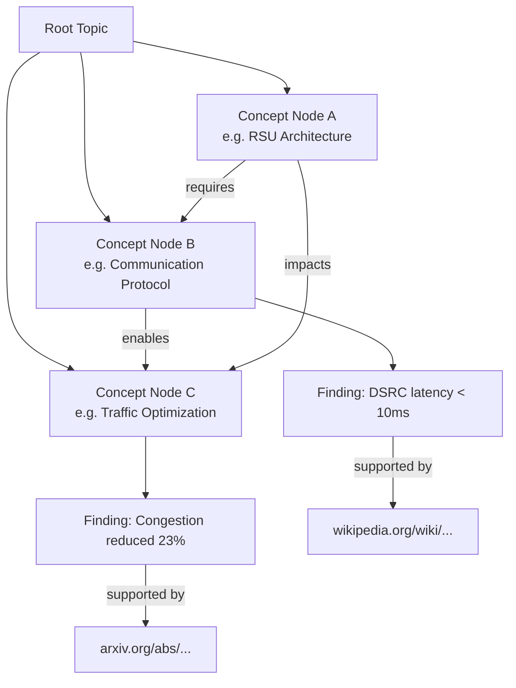
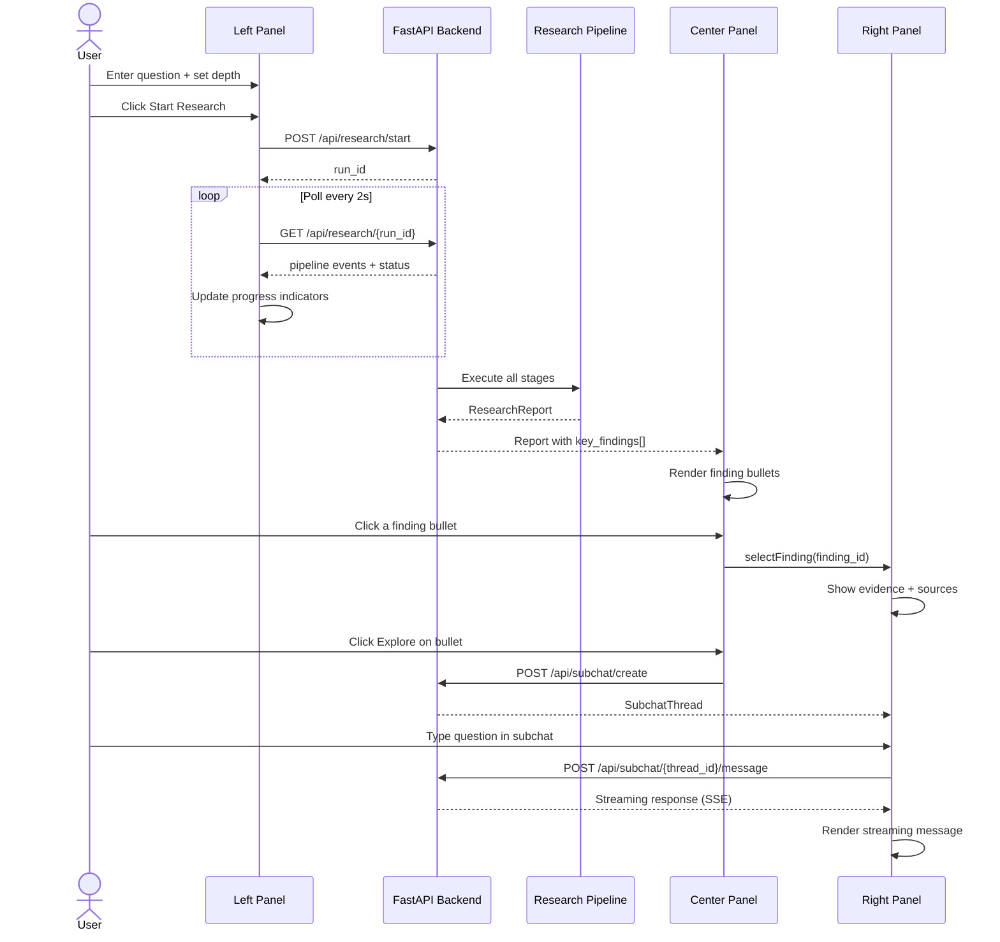
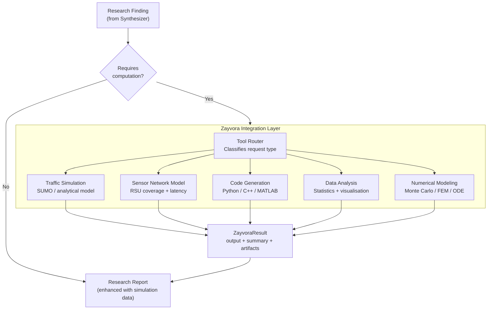

# Nex — Deep Research Engine

Nex is an **Autonomous Research Agent** that transforms a natural-language question into a structured, evidence-backed research report by autonomously querying 10–100 open-access sources, verifying claims, building a knowledge graph, and synthesising findings into an interactive research document.

---

## System Architecture



---

## Evidence Collection Architecture



---

## Knowledge Graph Model



---

## UI Interaction Flow



---

## Zayvora Integration Pipeline



---

## Repo Structure

```
nex/
├── core/                          # Python research engine
│   ├── __init__.py
│   ├── pipeline.py                # Pipeline orchestrator
│   ├── research_planner.py        # Module 1: Decompose question -> plan
│   ├── source_discovery.py        # Module 2: Find open-access sources
│   ├── evidence_collector.py      # Module 3: Fetch + extract evidence
│   ├── verification_engine.py     # Module 4: Cross-check + score claims
│   ├── knowledge_graph.py         # Module 5: Build concept graph
│   ├── research_synthesizer.py    # Module 6: Generate report
│   ├── zayvora_integration.py     # Module 7: Run Zayvora simulations
│   ├── subchat_engine.py          # Module 9: Per-finding chat threads
│   └── utils.py                   # Shared text/similarity utilities
│
├── api/                           # FastAPI backend
│   ├── __init__.py
│   └── main.py                    # REST + SSE API endpoints
│
├── frontend/                      # Next.js 14 + React + TypeScript
│   ├── app/
│   │   ├── layout.tsx
│   │   └── page.tsx               # 3-panel layout root
│   ├── components/
│   │   ├── LeftPanel.tsx          # Question input + pipeline progress
│   │   ├── CenterPanel.tsx        # Research findings + report
│   │   └── RightPanel.tsx         # Evidence, subchat, sources
│   ├── store/
│   │   └── research.ts            # Zustand global state
│   ├── styles/
│   │   └── globals.css            # Design tokens + global styles
│   ├── next.config.js
│   ├── package.json
│   └── tsconfig.json
│
├── docs/
│   ├── nex_architecture.md
│   ├── research_pipeline.md
│   └── ui_architecture.md
│
├── research/                      # Supporting analysis utilities
│   └── bias_detector.py
├── tests/                         # Regression/unit tests
│   └── test_bugfixes.py
├── .env.example
├── requirements.txt
└── README.md
```

---

## Module Reference

| Module | File | Responsibility |
|--------|------|----------------|
| Research Planner | `core/research_planner.py` | Decomposes question into subtopics, keywords, search queries using Claude |
| Source Discovery | `core/source_discovery.py` | Queries Wikipedia, arXiv, Semantic Scholar; filters paywalls; ranks by relevance |
| Evidence Collector | `core/evidence_collector.py` | Async fetches up to 50 sources; LLM extracts key claims + citations |
| Verification Engine | `core/verification_engine.py` | Clusters similar claims; assigns VERIFIED / LIKELY / LOW_CONFIDENCE |
| Knowledge Graph | `core/knowledge_graph.py` | LLM extracts concept nodes + relationships; exports Mermaid + JSON |
| Research Synthesizer | `core/research_synthesizer.py` | Claude Opus generates title, executive summary, findings, evidence sections |
| Zayvora Integration | `core/zayvora_integration.py` | Routes simulation requests to Zayvora tools; mock fallback when offline |
| Subchat Engine | `core/subchat_engine.py` | Per-finding chat threads with streaming, citations, Zayvora triggers |
| Pipeline | `core/pipeline.py` | Orchestrates all modules end-to-end with event streaming |
| Shared Utils | `core/utils.py` | Shared tokenization and claim similarity helpers used across modules |
| API | `api/main.py` | FastAPI: REST + SSE endpoints for frontend |

---

## Confidence Scoring

| Level | Criteria | Display |
|-------|----------|---------|
| **VERIFIED** | 3+ independent source domains OR quality score >= 6 | Green |
| **LIKELY** | 2 source domains OR quality score >= 3 | Amber |
| **LOW_CONFIDENCE** | Single low-quality source or contradicted | Red |

Source quality weights: `arxiv=3`, `gov=2`, `wikipedia=2`, `engineering_blog=1`, `web=1`

---

## API Endpoints

| Method | Path | Description |
|--------|------|-------------|
| `POST` | `/api/research/start` | Start a research pipeline run |
| `GET`  | `/api/research/{run_id}` | Poll run status + results |
| `GET`  | `/api/research/{run_id}/stream` | SSE stream of pipeline events |
| `GET`  | `/api/research/{run_id}/report/markdown` | Export report as Markdown |
| `GET`  | `/api/research/{run_id}/report/json` | Export report as JSON |
| `POST` | `/api/subchat/create` | Create subchat thread for a finding |
| `POST` | `/api/subchat/{thread_id}/message` | Stream a subchat response |
| `GET`  | `/api/subchat/{thread_id}/export` | Export thread history |
| `POST` | `/api/zayvora/run` | Execute a Zayvora simulation |
| `GET`  | `/api/zayvora/tools` | List available Zayvora tools |
| `GET`  | `/api/health` | Health check |

---

## Quick Start

```bash
# 1. Clone & setup
git clone https://github.com/via-decide/nex.git
cd nex

# 2. Backend
python -m venv .venv
source .venv/bin/activate
pip install -r requirements.txt

cp .env.example .env
# Add your ANTHROPIC_API_KEY to .env

uvicorn api.main:app --reload --port 8000

# 3. Frontend (separate terminal)
cd frontend
npm install
npm run dev
# -> http://localhost:3000
```

---

## Scaling Strategy

For large research tasks (exhaustive depth, 60–100 sources):

| Concern | Strategy |
|---------|----------|
| **Source volume** | Async HTTP with configurable concurrency (default 8x); rate-limited per API |
| **LLM cost** | Use `claude-haiku-4-5` for bulk extraction; reserve `claude-opus-4-6` for planning + synthesis |
| **Latency** | Stream pipeline events via SSE; progressive UI rendering as stages complete |
| **Persistence** | Replace in-memory `_runs` dict with PostgreSQL + background worker (Celery/ARQ) |
| **Caching** | Cache source fetches + LLM extractions by URL hash for repeated queries |
| **Parallelism** | `asyncio.gather` for source collection; independent subtopics can run parallel pipelines |
| **Knowledge graph** | For graphs > 100 nodes, use Neo4j instead of in-memory dict |

---

## Zayvora Tool Types

| Tool | Use Case |
|------|----------|
| `traffic_simulation` | Model V2X congestion effects, RSU spacing impact |
| `sensor_network_model` | RSU coverage, RSSI, handoff rate analysis |
| `code_generation` | Generate protocol implementations, test harnesses |
| `data_analysis` | Statistical analysis of research datasets |
| `numerical_modeling` | Monte Carlo, FEM, ODE solvers for quantitative validation |
| `custom` | Any custom Zayvora-compatible computation |
