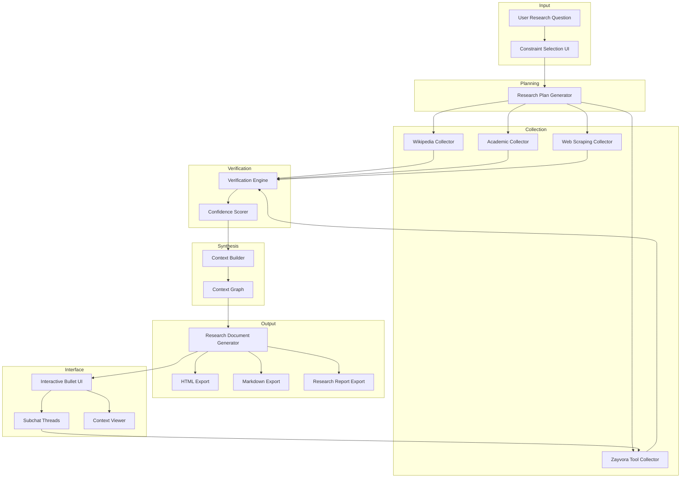

# Nex Research Engine — Architecture Specification

## Overview

Nex is a structured research system that transforms a user's research question into a verified, evidence-backed research document with interactive exploration capabilities. It is **not** a chatbot — it is a pipeline that plans, collects, verifies, synthesizes, and presents research.

---

## Core Principles

1. **Evidence-first** — every claim maps to a verifiable source
2. **Structured output** — research is organized, not conversational
3. **Verification by default** — conflicting or unsupported claims are flagged or removed
4. **Composable depth** — users drill into any finding via subchat threads
5. **Computation-ready** — Zayvora tools extend research with simulation and analysis

---

## System Architecture



---

## Module Specifications

### 1. Research Plan Generator

**Responsibility:** Decompose a research question into structured sub-queries.

**Input:**
```typescript
interface ResearchRequest {
  question: string;
  constraints: Constraint[];
  depth: "overview" | "standard" | "deep";
  domain?: string;
}
```

**Output:**
```typescript
interface ResearchPlan {
  id: string;
  question: string;
  subQueries: SubQuery[];
  collectorTargets: CollectorType[];
  estimatedSources: number;
  createdAt: string;
}

interface SubQuery {
  id: string;
  query: string;
  priority: number;
  targetCollectors: CollectorType[];
}
```

**Behavior:**
- Analyzes the question to identify key concepts, entities, and relationships
- Generates 3–10 sub-queries ranked by priority
- Determines which collectors are relevant for each sub-query
- Respects user-selected constraints (time period, source types, domains)

---

### 2. Evidence Collectors

All collectors implement a shared interface:

```typescript
interface EvidenceCollector {
  type: CollectorType;
  collect(query: SubQuery): Promise<EvidenceItem[]>;
}

type CollectorType = "wikipedia" | "academic" | "web" | "zayvora";

interface EvidenceItem {
  id: string;
  source: CollectorType;
  topic: string;
  summary: string;
  content: string;
  references: Reference[];
  metadata: Record<string, unknown>;
  collectedAt: string;
}

interface Reference {
  title: string;
  url?: string;
  doi?: string;
  authors?: string[];
  year?: number;
}
```

#### 2a. Wikipedia Collector

- Queries Wikipedia API for relevant articles
- Extracts structured sections, summaries, and reference lists
- Follows citation links to primary sources when available
- Rate-limited to respect API guidelines

#### 2b. Academic Collector

- Searches Google Scholar and arXiv for papers
- Extracts titles, abstracts, authors, citation counts
- Prioritizes highly-cited and recent papers
- Retrieves open-access full text where available

#### 2c. Web Scraping Collector

- Crawls public web pages (no login-gated content)
- Extracts main content using readability heuristics
- Filters out advertisements, navigation, and boilerplate
- Respects robots.txt and rate limits

#### 2d. Zayvora Tool Collector

- Invoked when research requires computation (modeling, simulation, data analysis)
- Wraps Zayvora tool execution in the evidence item format
- Returns simulation results, computed datasets, or analysis outputs as evidence

---

### 3. Verification Engine

**Responsibility:** Cross-check evidence, resolve conflicts, assign confidence.

```typescript
interface VerificationResult {
  item: EvidenceItem;
  confidence: ConfidenceLevel;
  corroboratedBy: string[];    // IDs of supporting evidence
  conflictsWith: string[];     // IDs of conflicting evidence
  notes: string[];
}

type ConfidenceLevel = "VERIFIED" | "LIKELY" | "LOW_CONFIDENCE";
```

**Verification rules:**

| Condition | Confidence |
|-----------|------------|
| Claim supported by 3+ independent sources | `VERIFIED` |
| Claim supported by 1–2 sources, no conflicts | `LIKELY` |
| Claim from single source or has conflicts | `LOW_CONFIDENCE` |

**Process:**
1. Group evidence items by topic/claim
2. Identify corroborating and conflicting claims via semantic similarity
3. Assign confidence scores
4. Flag `LOW_CONFIDENCE` items for user review
5. Remove items that are directly contradicted by `VERIFIED` evidence (unless user opts to keep conflicts)

---

### 4. Context Builder

**Responsibility:** Merge verified evidence into a structured context graph.

```typescript
interface ContextGraph {
  id: string;
  topic: string;
  nodes: ContextNode[];
  edges: ContextEdge[];
}

interface ContextNode {
  id: string;
  type: "finding" | "evidence" | "reference" | "simulation" | "code_example";
  title: string;
  content: string;
  confidence: ConfidenceLevel;
  sources: string[];
}

interface ContextEdge {
  from: string;
  to: string;
  relation: "supports" | "contradicts" | "extends" | "derived_from";
}
```

**Behavior:**
- Organizes evidence into a directed graph of findings
- Groups related findings under topic clusters
- Links evidence to findings, references to evidence
- Attaches Zayvora simulation outputs as derived nodes
- Produces a traversable structure for the document generator

---

### 5. Research Document Generator

**Responsibility:** Transform the context graph into a structured research document.

```typescript
interface ResearchDocument {
  id: string;
  title: string;
  summary: string;
  sections: DocumentSection[];
  sources: Reference[];
  exportFormats: ExportFormat[];
  generatedAt: string;
}

interface DocumentSection {
  id: string;
  heading: string;
  bullets: BulletPoint[];
  evidence: EvidenceItem[];
  subsections?: DocumentSection[];
}

interface BulletPoint {
  id: string;
  text: string;
  confidence: ConfidenceLevel;
  sourceIds: string[];
  expandable: boolean;
  subChatEnabled: boolean;
}

type ExportFormat = "html" | "markdown" | "report";
```

**Output structure:**
1. Title
2. Summary (2–3 paragraphs)
3. Key Findings (bullet list, each expandable)
4. Evidence Sections (grouped by topic)
5. Sources (full reference list)
6. Interactive Elements (simulations, code, data)

---

### 6. Zayvora Integration Layer

**Responsibility:** Bridge between Nex research context and Zayvora computational tools.

```typescript
interface ZayvoraRequest {
  toolName: string;
  parameters: Record<string, unknown>;
  researchContext: string;
  parentFindingId: string;
}

interface ZayvoraResponse {
  result: unknown;
  visualization?: string;
  summary: string;
  executionTime: number;
}
```

**Supported operations:**
- Traffic modeling and simulation
- Data analysis and statistical computation
- Numerical modeling
- Custom tool execution

**Pipeline:**
```
Research Finding → Tool Selection → Parameter Extraction → Zayvora Execution → Result Parsing → Context Update
```

---

## Data Flow Summary

```
User Question
  → Constraints + Depth
    → Research Plan (sub-queries)
      → Parallel Evidence Collection (4 collectors)
        → Verification + Confidence Scoring
          → Context Graph Construction
            → Research Document Generation
              → Interactive UI + Subchat Threads
```

---

## Technology Stack

| Layer | Technology |
|-------|-----------|
| Runtime | Node.js / TypeScript |
| API Layer | Next.js API routes |
| Frontend | React + Next.js |
| State Management | Zustand |
| Evidence Storage | SQLite (local) / PostgreSQL (deployed) |
| Search | Full-text search via SQLite FTS5 or pg_trgm |
| Export | Unified (for Markdown), Puppeteer (for HTML/PDF) |
| Zayvora Integration | HTTP client with retry + circuit breaker |

---

## Scaling Considerations

1. **Parallel collection** — all four collectors run concurrently per sub-query
2. **Incremental verification** — verification runs as evidence arrives, not after all collection completes
3. **Cached evidence** — repeated queries hit a local evidence cache before re-collecting
4. **Streaming output** — the UI renders progressively as sections are generated
5. **Worker-based collection** — heavy collectors (web scraping, academic) can be offloaded to background workers
6. **Context graph pruning** — for large research tasks, low-confidence nodes are pruned to keep the graph manageable
7. **Pagination** — research documents with 50+ findings use paginated sections with lazy-loaded evidence
