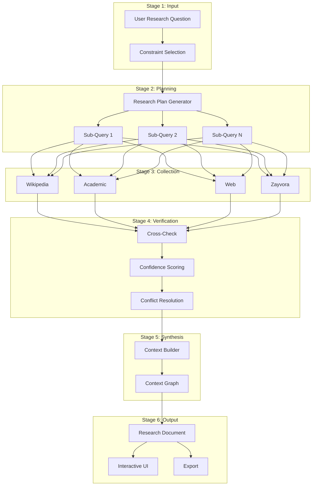
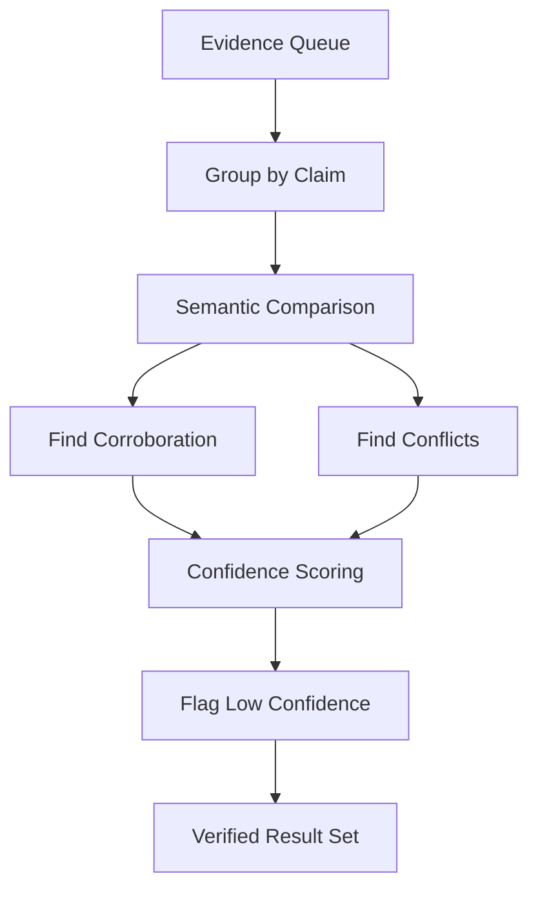
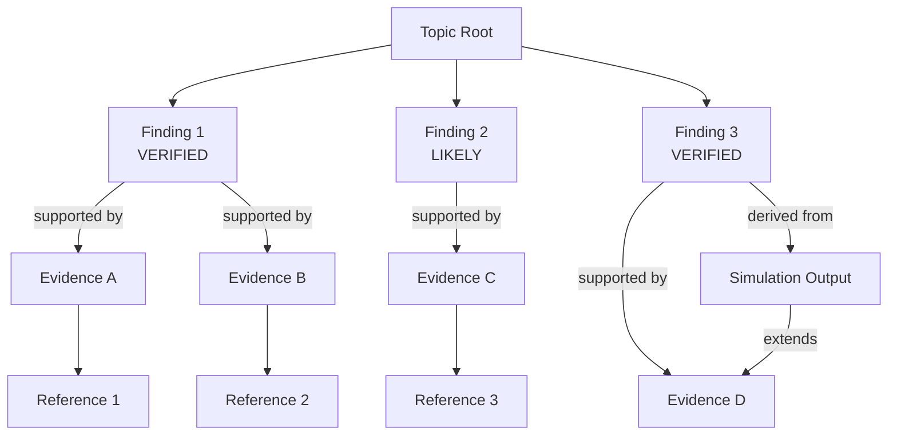

# Nex Research Pipeline

## Pipeline Overview

The Nex research pipeline transforms a user question into a verified, structured research document through six sequential stages. Each stage has defined inputs, outputs, and failure modes.

---

## Pipeline Diagram



---

## Stage 1: Input & Constraint Selection

### User Research Question

The user enters a natural-language research question. Examples:

- "What are the effects of urban green spaces on mental health?"
- "How does RSU spacing affect V2X network congestion?"
- "Compare transformer architectures for time-series forecasting"

### Constraint Selection UI

A StudyOS-style constraint panel allows users to scope the research:

| Constraint | Options | Default |
|-----------|---------|---------|
| Depth | Overview / Standard / Deep | Standard |
| Time Range | Last year / Last 5 years / All time | All time |
| Source Types | Wikipedia / Academic / Web / All | All |
| Domain Filter | Free-text domain restriction | None |
| Computation | Allow Zayvora tools | Yes |
| Language | en / multi | en |

**Output:** `ResearchRequest` object passed to the planner.

---

## Stage 2: Research Planning

### Plan Generation

The Research Plan Generator:

1. **Parses** the question to extract key entities, relationships, and intent
2. **Decomposes** into 3–10 sub-queries, each targeting a specific aspect
3. **Prioritizes** sub-queries (P1 = critical, P3 = supplementary)
4. **Assigns collectors** — each sub-query maps to one or more collector types

### Example Plan

**Question:** "How does RSU spacing affect V2X network congestion?"

| Priority | Sub-Query | Collectors |
|----------|-----------|------------|
| P1 | "V2X RSU spacing network performance" | academic, wikipedia |
| P1 | "RSU deployment density congestion" | academic, web |
| P2 | "V2X communication standards overview" | wikipedia |
| P2 | "RSU spacing simulation models" | academic, zayvora |
| P3 | "Real-world RSU deployment case studies" | web |

---

## Stage 3: Evidence Collection

### Collection Architecture

```mermaid
flowchart LR
    subgraph Dispatcher
        D[Query Dispatcher]
    end

    subgraph Collectors
        W[Wikipedia\nCollector]
        A[Academic\nCollector]
        S[Web Scraping\nCollector]
        Z[Zayvora\nCollector]
    end

    subgraph Output
        EQ[Evidence Queue]
    end

    D -->|sub-query| W
    D -->|sub-query| A
    D -->|sub-query| S
    D -->|sub-query| Z
    W -->|EvidenceItem[]| EQ
    A -->|EvidenceItem[]| EQ
    S -->|EvidenceItem[]| EQ
    Z -->|EvidenceItem[]| EQ
```

### Collector Specifications

#### Wikipedia Collector

```
Input:  SubQuery
API:    Wikipedia REST API (en.wikipedia.org/api/rest_v1)
Steps:
  1. Search for relevant articles
  2. Retrieve article content + sections
  3. Extract summary, key claims, and references
  4. Follow reference links to identify primary sources
Output: EvidenceItem[] with source="wikipedia"
```

#### Academic Collector

```
Input:  SubQuery
APIs:   arXiv API, Semantic Scholar API, CrossRef
Steps:
  1. Search for papers matching query
  2. Rank by relevance, citation count, recency
  3. Retrieve abstracts and metadata
  4. Fetch open-access full text where available
  5. Extract key findings from abstracts
Output: EvidenceItem[] with source="academic"
```

#### Web Scraping Collector

```
Input:  SubQuery
Method: HTTP fetch + readability extraction
Steps:
  1. Search via public search API
  2. Fetch top-N result pages
  3. Extract main content (strip nav, ads, boilerplate)
  4. Identify claims and factual statements
  5. Record source URL and publication date
Rules:
  - Respect robots.txt
  - No login-gated content
  - Rate-limited (max 2 requests/second per domain)
Output: EvidenceItem[] with source="web"
```

#### Zayvora Tool Collector

```
Input:  SubQuery + Research Context
Method: Zayvora API invocation
Steps:
  1. Determine if query requires computation
  2. Select appropriate Zayvora tool
  3. Extract parameters from research context
  4. Execute tool
  5. Parse results into evidence format
Output: EvidenceItem[] with source="zayvora"
```

### Evidence Item Schema

```json
{
  "id": "ev_a1b2c3",
  "source": "academic",
  "topic": "RSU spacing and congestion",
  "summary": "Study finds that RSU spacing below 300m reduces packet loss by 40% in urban V2X networks.",
  "content": "Full extracted text or abstract...",
  "references": [
    {
      "title": "Optimal RSU Deployment for V2X",
      "doi": "10.1109/TVT.2023.1234567",
      "authors": ["Zhang, L.", "Kumar, R."],
      "year": 2023
    }
  ],
  "metadata": {
    "citationCount": 45,
    "publicationDate": "2023-06-15"
  },
  "collectedAt": "2026-04-05T14:30:00Z"
}
```

---

## Stage 4: Verification

### Verification Pipeline



### Cross-Check Process

1. **Claim extraction** — each evidence item is reduced to atomic claims
2. **Semantic grouping** — claims are clustered by semantic similarity
3. **Corroboration check** — within each cluster, count independent sources supporting each claim
4. **Conflict detection** — identify claims within the same cluster that contradict each other
5. **Resolution** — conflicting claims are either:
   - Both kept with `LOW_CONFIDENCE` and a conflict note
   - Resolved in favor of the higher-corroboration claim (if difference is 3+ sources)

### Confidence Assignment

| Rule | Result |
|------|--------|
| 3+ independent sources agree | `VERIFIED` |
| 1–2 sources, no contradictions | `LIKELY` |
| Single source | `LOW_CONFIDENCE` |
| Any contradicting evidence exists | `LOW_CONFIDENCE` (both sides) |
| Zayvora simulation confirms claim | Upgrade by one level |
| Source is a peer-reviewed publication | +1 to corroboration count |

---

## Stage 5: Context Building

### Context Graph Construction

The Context Builder assembles verified evidence into a directed acyclic graph.



### Graph Operations

| Operation | Description |
|-----------|-------------|
| **Cluster** | Group findings by sub-topic |
| **Rank** | Order findings by confidence then relevance |
| **Prune** | Remove orphan nodes with no supporting evidence |
| **Link** | Connect findings that support or extend each other |
| **Annotate** | Attach confidence badges and source counts |

---

## Stage 6: Output Generation

### Document Structure

```
Research Document
├── Title
├── Summary (2-3 paragraphs)
├── Key Findings
│   ├── Bullet 1 [VERIFIED] → expandable
│   ├── Bullet 2 [VERIFIED] → expandable
│   ├── Bullet 3 [LIKELY] → expandable
│   └── ...
├── Evidence Sections
│   ├── Section A
│   │   ├── Findings
│   │   ├── Supporting evidence
│   │   └── References
│   ├── Section B
│   │   └── ...
│   └── ...
├── Simulation Results (if any)
├── Source List
└── Export Options [HTML | Markdown | Report]
```

### Export Formats

| Format | Method | Use Case |
|--------|--------|----------|
| HTML | Rendered interactive page (Safari-style) | Primary viewing |
| Markdown | Structured markdown with tables | Sharing, embedding |
| Report | Formal PDF with citations | Academic, professional |

---

## Error Handling

| Stage | Failure Mode | Recovery |
|-------|-------------|----------|
| Collection | Collector timeout | Skip collector, note gap in output |
| Collection | No results found | Broaden sub-query, try alternate collectors |
| Verification | All evidence is LOW_CONFIDENCE | Present with warning banner |
| Context Build | Conflicting graph structure | Flatten to list, flag for user review |
| Zayvora | Tool execution failure | Present research without simulation, note gap |
| Export | Rendering failure | Fall back to Markdown export |

---

## Performance Targets

| Metric | Target |
|--------|--------|
| Plan generation | < 3 seconds |
| Evidence collection (all collectors) | < 30 seconds |
| Verification | < 5 seconds |
| Context building | < 3 seconds |
| Document generation | < 5 seconds |
| **Total pipeline (standard depth)** | **< 45 seconds** |
| Deep research | < 2 minutes |
