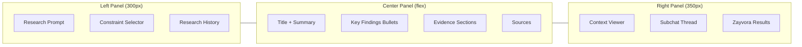
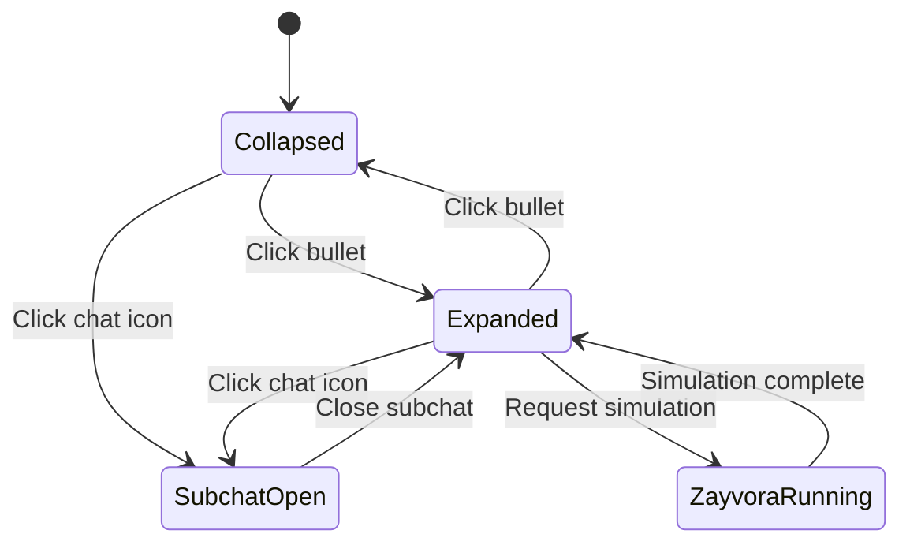
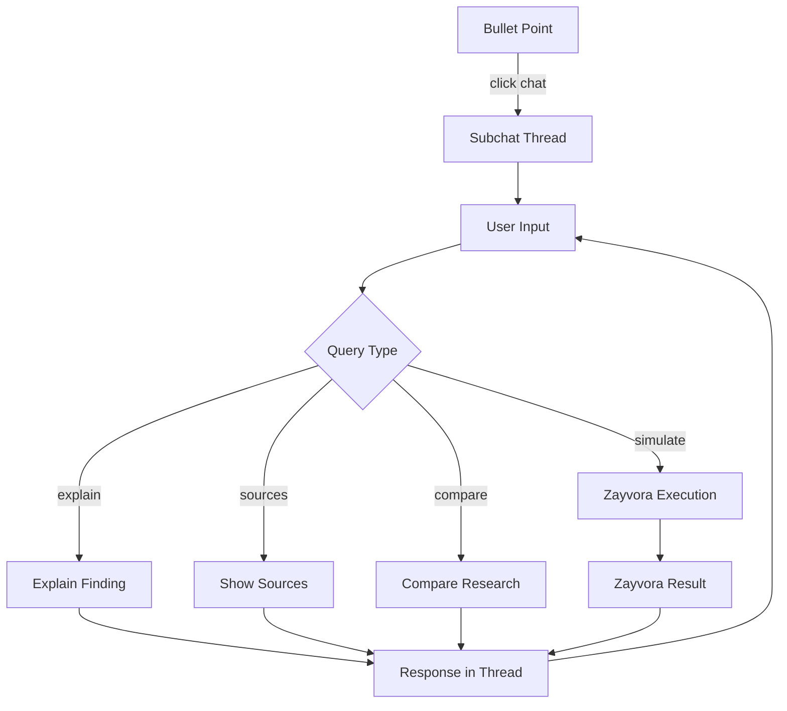
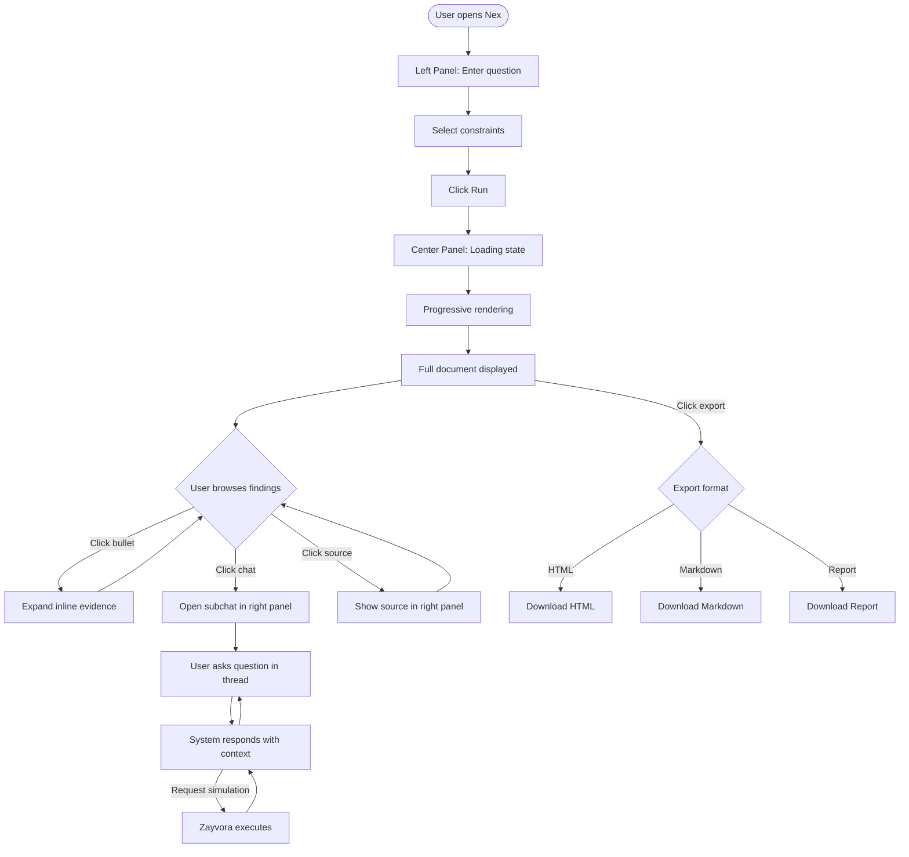

# Nex UI Architecture

## Design Philosophy

The Nex UI is **minimal, information-dense, and interactive**. It borrows the clean aesthetic of Apple Safari's reading mode while adding structured research exploration through expandable bullets and subchat threads.

---

## 3-Panel Layout



### Panel Specifications

#### Left Panel — Research Input (300px, collapsible)

| Component | Description |
|-----------|-------------|
| **Research Prompt** | Text input for the research question |
| **Constraint Selector** | StudyOS-style toggles and dropdowns |
| **Depth Selector** | Overview / Standard / Deep radio buttons |
| **Source Filter** | Checkboxes: Wikipedia, Academic, Web, Zayvora |
| **Time Range** | Dropdown: Last year / 5 years / All time |
| **Domain Filter** | Free-text input for domain restriction |
| **Research History** | List of past research sessions |
| **Run Button** | Executes the research pipeline |

#### Center Panel — Research Results (flex-grow, min 500px)

| Component | Description |
|-----------|-------------|
| **Title** | Generated research title |
| **Summary** | 2–3 paragraph overview |
| **Key Findings** | Bullet list, each with confidence badge |
| **Evidence Sections** | Grouped by topic, expandable |
| **Sources** | Full reference list with links |
| **Export Bar** | HTML / Markdown / Report buttons |

#### Right Panel — Context & Subchat (350px, collapsible)

| Component | Description |
|-----------|-------------|
| **Context Viewer** | Shows evidence details for selected bullet |
| **Source Summary** | Displays source metadata and content |
| **Subchat Thread** | Mini research conversation per bullet |
| **Zayvora Results** | Simulation outputs and visualizations |

---

## Interactive Bullet System

### Bullet Point Structure

Each research finding is rendered as an interactive bullet point:

```
┌─────────────────────────────────────────────────┐
│ ● RSU spacing below 300m reduces packet loss    │
│   by 40% in urban V2X networks                  │
│                                                 │
│   [VERIFIED]  [3 sources]  [▶ Expand]  [💬 Chat]│
└─────────────────────────────────────────────────┘
```

### Bullet States



### Bullet Components

| Element | Behavior |
|---------|----------|
| **Confidence Badge** | Color-coded: green (VERIFIED), yellow (LIKELY), red (LOW_CONFIDENCE) |
| **Source Count** | Shows number of supporting sources |
| **Expand Toggle** | Reveals supporting evidence inline |
| **Chat Icon** | Opens subchat thread in right panel |
| **Zayvora Icon** | Appears when computation is available; triggers simulation |

### Expanded Bullet View

When a bullet is expanded, it reveals:

```
● RSU spacing below 300m reduces packet loss by 40%     [VERIFIED]
  ├── Evidence: Zhang et al. (2023) — IEEE TVT
  │   "Our simulation of 500 RSUs showed that spacing below 300m..."
  ├── Evidence: Kumar & Lee (2022) — arXiv
  │   "Field tests in Seoul confirm reduced congestion at 250m spacing..."
  ├── Evidence: Wikipedia — V2X Communication
  │   "Standards recommend RSU spacing between 200-400m..."
  └── [Run Zayvora Simulation] [Open Subchat]
```

---

## Subchat System

### Architecture



### Subchat Thread Model

Each bullet point can spawn an independent subchat thread:

```typescript
interface SubchatThread {
  id: string;
  bulletId: string;
  parentDocumentId: string;
  messages: SubchatMessage[];
  context: {
    finding: string;
    evidence: EvidenceItem[];
    confidence: ConfidenceLevel;
  };
  createdAt: string;
}

interface SubchatMessage {
  id: string;
  role: "user" | "system";
  content: string;
  attachments?: SubchatAttachment[];
  timestamp: string;
}

interface SubchatAttachment {
  type: "evidence" | "source" | "simulation" | "comparison";
  data: unknown;
}
```

### Subchat Capabilities

| Action | Description |
|--------|-------------|
| **Explain study** | Provide a detailed breakdown of the finding and its evidence |
| **Show sources** | List all sources with full metadata and links |
| **Compare research** | Side-by-side comparison of different studies on the same topic |
| **Run simulation** | Trigger a Zayvora tool to compute/simulate based on the finding |
| **Ask follow-up** | Free-form question scoped to the bullet's context |
| **Deep dive** | Launch a new Nex research session on a sub-topic |

### Example Subchat Interaction

```
┌──────────────────────────────────────────┐
│ Subchat: RSU spacing reduces congestion  │
├──────────────────────────────────────────┤
│                                          │
│ USER: Explain the Zhang et al. study     │
│                                          │
│ SYSTEM: Zhang et al. (2023) conducted    │
│ a simulation study using SUMO and NS-3   │
│ with 500 RSUs deployed across a 10km²    │
│ urban grid. Key findings:                │
│                                          │
│ • 300m spacing: 40% packet loss reduction│
│ • 250m spacing: 52% reduction            │
│ • Below 200m: diminishing returns        │
│                                          │
│ [Source: IEEE TVT, DOI: 10.1109/...]     │
│                                          │
│ USER: Run a simulation with 400m spacing │
│                                          │
│ SYSTEM: Running Zayvora simulation...    │
│ ████████████░░░ 80%                      │
│                                          │
│ Results:                                 │
│ • 400m spacing: 28% packet loss reduction│
│ • Confirms diminishing returns above 300m│
│ • [View full simulation output]          │
│                                          │
└──────────────────────────────────────────┘
```

---

## UI Interaction Flow



---

## Responsive Behavior

| Viewport | Layout |
|----------|--------|
| Desktop (1200px+) | 3-panel side-by-side |
| Tablet (768–1199px) | 2-panel, left panel becomes drawer |
| Mobile (< 768px) | Single panel with tab navigation |

### Mobile Tab Structure

```
[Research] [Results] [Context]
```

- **Research tab** — prompt + constraints
- **Results tab** — bullet findings + evidence
- **Context tab** — subchat + source viewer

---

## Component Hierarchy

```
App
├── Layout
│   ├── LeftPanel
│   │   ├── ResearchPrompt
│   │   ├── ConstraintSelector
│   │   │   ├── DepthSelector
│   │   │   ├── SourceFilter
│   │   │   ├── TimeRange
│   │   │   └── DomainFilter
│   │   ├── RunButton
│   │   └── ResearchHistory
│   ├── CenterPanel
│   │   ├── DocumentHeader
│   │   │   ├── Title
│   │   │   └── Summary
│   │   ├── KeyFindings
│   │   │   └── BulletPoint (repeated)
│   │   │       ├── ConfidenceBadge
│   │   │       ├── SourceCount
│   │   │       ├── ExpandToggle
│   │   │       ├── ChatIcon
│   │   │       └── ExpandedEvidence (conditional)
│   │   ├── EvidenceSections
│   │   │   └── EvidenceSection (repeated)
│   │   ├── SourceList
│   │   └── ExportBar
│   └── RightPanel
│       ├── ContextViewer
│       │   ├── SourceSummary
│       │   └── EvidenceDetail
│       ├── SubchatThread
│       │   ├── MessageList
│       │   ├── SubchatInput
│       │   └── AttachmentViewer
│       └── ZayvoraResults
│           ├── SimulationOutput
│           └── VisualizationPane
└── StatusBar
    ├── PipelineProgress
    └── CollectorStatus
```

---

## State Management

Using Zustand for lightweight, predictable state:

```typescript
interface NexState {
  // Research input
  question: string;
  constraints: Constraint[];

  // Pipeline
  pipelineStatus: "idle" | "planning" | "collecting" | "verifying" | "building" | "generating" | "complete";
  currentPlan: ResearchPlan | null;

  // Results
  document: ResearchDocument | null;
  contextGraph: ContextGraph | null;

  // UI state
  expandedBullets: Set<string>;
  activeSubchat: string | null;
  selectedSource: string | null;
  rightPanelView: "context" | "subchat" | "zayvora";

  // Subchats
  subchats: Map<string, SubchatThread>;

  // Actions
  runResearch: (question: string, constraints: Constraint[]) => Promise<void>;
  toggleBullet: (id: string) => void;
  openSubchat: (bulletId: string) => void;
  sendSubchatMessage: (threadId: string, message: string) => Promise<void>;
  requestSimulation: (bulletId: string, params: Record<string, unknown>) => Promise<void>;
  exportDocument: (format: ExportFormat) => Promise<void>;
}
```

---

## Visual Design Tokens

| Token | Value | Usage |
|-------|-------|-------|
| `--nex-bg` | `#FAFAFA` | Page background |
| `--nex-surface` | `#FFFFFF` | Card/panel background |
| `--nex-border` | `#E5E5E5` | Panel dividers |
| `--nex-text` | `#1A1A1A` | Primary text |
| `--nex-text-secondary` | `#666666` | Secondary text |
| `--nex-verified` | `#34C759` | VERIFIED badge |
| `--nex-likely` | `#FF9500` | LIKELY badge |
| `--nex-low` | `#FF3B30` | LOW_CONFIDENCE badge |
| `--nex-accent` | `#007AFF` | Interactive elements |
| `--nex-font` | `SF Pro Text, -apple-system, sans-serif` | Body text |
| `--nex-font-mono` | `SF Mono, monospace` | Code, data |
| `--nex-radius` | `8px` | Border radius |
| `--nex-shadow` | `0 1px 3px rgba(0,0,0,0.1)` | Card shadow |
